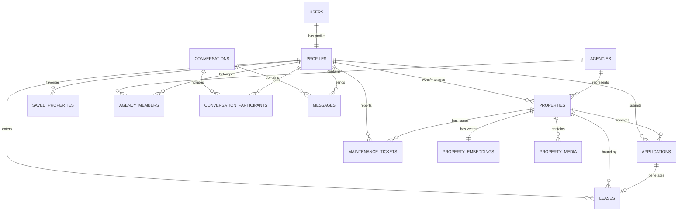

# HomiFind — Supabase Architecture & Technical Blueprint

This document details the complete Supabase backend architecture designed for **HomiFind**, an AI-powered multi-role real estate workspace supporting **Renters**, **Owners**, and **Brokers**.

---

## 1. High-Level Architecture Overview

```
                          ┌───────────────────────────┐
                          │   HomiFind Frontend / App  │
                          └─────────────┬─────────────┘
                                        │
           ┌────────────────────────────┼────────────────────────────┐
           ▼                            ▼                            ▼
┌────────────────────┐       ┌────────────────────┐       ┌────────────────────┐
│   Supabase Auth    │       │  Supabase Realtime │       │  Storage Buckets   │
│ - JWT Claims       │       │ - Messages         │       │ - Property Images  │
│ - OAuth / Email    │       │ - Applications     │       │ - User Avatars     │
│ - Auto-Profile     │       │ - Maintenance      │       │ - Private Docs     │
└──────────┬─────────┘       └──────────┬─────────┘       └──────────┬─────────┘
           │                            │                            │
           └────────────────────────────┼────────────────────────────┘
                                        │
                                        ▼
                   ┌─────────────────────────────────────────┐
                   │    PostgreSQL Database (With Extensions) │
                   ├─────────────────────────────────────────┤
                   │  - uuid-ossp (UUID primary keys)        │
                   │  - pgvector (AI similarity & matching)  │
                   │  - pg_trgm (Fuzzy text search)          │
                   │  - Row Level Security (RLS) on all      │
                   └────────────────────┬────────────────────┘
                                        │
                                        ▼
                         ┌─────────────────────────────┐
                         │   Supabase Edge Functions   │
                         ├─────────────────────────────┤
                         │ - match-properties (pgvector)│
                         │ - ai-description-generator  │
                         │ - send-notification         │
                         └─────────────────────────────┘
```

---

## 2. Entity-Relationship (ER) Diagram



---

## 3. Core Tables & Relationships

| Table Name | Description | Key Relationships |
| :--- | :--- | :--- |
| `profiles` | Multi-role user metadata (renter, owner, broker, admin) | `id -> auth.users.id` |
| `user_preferences` | Search parameters & vector lifestyle embedding | `user_id -> profiles.id` |
| `agencies` | Brokerage agencies & broker workspaces | `owner_id -> profiles.id` |
| `agency_members` | Agency membership mapping | `agency_id -> agencies.id`, `broker_id -> profiles.id` |
| `properties` | Primary rental property listings | `owner_id -> profiles.id`, `broker_id -> profiles.id`, `agency_id -> agencies.id` |
| `property_embeddings` | 1536-dimensional `pgvector` embeddings for AI search | `property_id -> properties.id` |
| `property_media` | Images, floorplans, videos, 3D tours | `property_id -> properties.id` |
| `saved_properties` | Renters' saved/bookmarked listings | `renter_id -> profiles.id`, `property_id -> properties.id` |
| `applications` | Digital rental applications & screening disclosures | `property_id -> properties.id`, `renter_id -> profiles.id` |
| `leases` | Legally binding lease agreements & signature statuses | `application_id -> applications.id`, `property_id -> properties.id`, `renter_id`, `owner_id`, `broker_id` |
| `maintenance_tickets` | Tenant repair tickets & vendor dispatching | `property_id -> properties.id`, `renter_id -> profiles.id`, `assigned_vendor_id -> profiles.id` |
| `conversations` | Workspace messaging threads | `property_id -> properties.id` |
| `conversation_participants` | Thread participant mapping | `conversation_id -> conversations.id`, `user_id -> profiles.id` |
| `messages` | Chat messages with realtime broadcast | `conversation_id -> conversations.id`, `sender_id -> profiles.id` |
| `activity_logs` | System audit & notification event trail | `user_id -> profiles.id` |

---

## 4. Multi-Role Row Level Security (RLS) Policy Matrix

| Table | Renter Access | Owner Access | Broker Access | Public Access |
| :--- | :--- | :--- | :--- | :--- |
| `properties` | Read `available` properties | Full CRUD on own properties | Full CRUD on assigned/agency properties | Read `available` properties |
| `property_embeddings` | Read via `match_properties` RPC | System managed | System managed | Read via RPC |
| `applications` | CRUD on own submitted apps | Read & Update status on property apps | Read & Update status on property apps | None |
| `leases` | Read & Sign own leases | Read, Create, & Sign own property leases | Read, Manage, & Sign assigned leases | None |
| `maintenance_tickets` | Create & Read own reported tickets | Read & Update status for own properties | Read & Update status for assigned properties | None |
| `messages` | Read/Send in joined conversations | Read/Send in joined conversations | Read/Send in joined conversations | None |

---

## 5. Storage Buckets Configuration

1. **`property-images`** (Public)
   - *Allowed Mime Types:* `image/jpeg`, `image/png`, `image/webp`, `image/heic`
   - *Max Size:* 10MB
   - *Access Policy:* Anyone can view/download; Authenticated property owners/brokers can upload and delete.

2. **`user-avatars`** (Public)
   - *Allowed Mime Types:* `image/jpeg`, `image/png`, `image/webp`
   - *Max Size:* 5MB
   - *Access Policy:* Anyone can view/download; Users can update objects in `user-avatars/{user_id}/*`.

3. **`application-documents`** (Private)
   - *Allowed Mime Types:* `application/pdf`, `image/jpeg`, `image/png`
   - *Max Size:* 20MB
   - *Access Policy:* Applicant renters and property owners/brokers associated with the specific application.

4. **`lease-documents`** (Private)
   - *Allowed Mime Types:* `application/pdf`
   - *Max Size:* 20MB
   - *Access Policy:* Strictly bound to the tenant, landlord, and assigned broker on the lease contract.

---

## 6. Authentication & Database Triggers

### Automated Profile Creation Trigger (`on_auth_user_created`)
When a user signs up through Supabase Auth (Email, Google, OAuth), the PostgreSQL trigger automatically intercepts `auth.users` insertion, extracts user metadata (`full_name`, `role`, `avatar_url`), inserts a record into `public.profiles`, and initializes default preferences if the user is a renter.

---

## 7. AI Vector Search (`pgvector`) & Indexes

### Embedding Model & Vector Dimension
- **Vector Dimension:** `1536` (Supports Gemini Embedding API and OpenAI Embeddings).
- **Index Type:** `HNSW` (Hierarchical Navigable Small World) with `vector_cosine_ops` for high-speed similarity search.

```sql
CREATE INDEX idx_property_embeddings_vector 
  ON public.property_embeddings 
  USING hnsw (embedding vector_cosine_ops)
  WITH (m = 16, ef_construction = 64);
```

### Semantic Search RPC Function (`match_properties`)
Executes cosine distance calculation `1 - (pe.embedding <=> query_embedding)` filtered dynamically by price, bedrooms, property type, and city location.

---

## 8. Supabase Edge Functions

1. **`match-properties`**: Accepts natural language queries (e.g. *"2-bedroom pet friendly apartment near downtown under $2500"*), computes the embedding using Gemini API, and invokes the `match_properties` RPC function.
2. **`ai-description-generator`**: Generates high-converting property descriptions, bullet points, and SEO search tags for property owners and brokers.
3. **`send-notification`**: Logs audit events and dispatches cross-role alerts for application updates, lease signatures, and maintenance tickets.

---

## 9. Realtime Setup

Realtime broadcasting is enabled on key interactive tables:
```sql
ALTER PUBLICATION supabase_realtime ADD TABLE public.messages;
ALTER PUBLICATION supabase_realtime ADD TABLE public.applications;
ALTER PUBLICATION supabase_realtime ADD TABLE public.maintenance_tickets;
```

---

## 10. How to Deploy to Supabase

```bash
# 1. Login to Supabase CLI
supabase login

# 2. Link your project
supabase link --project-ref your-supabase-project-ref

# 3. Push schema & migrations to database
supabase db push

# 4. Deploy Edge Functions
supabase functions deploy match-properties
supabase functions deploy ai-description-generator
supabase functions deploy send-notification
```
